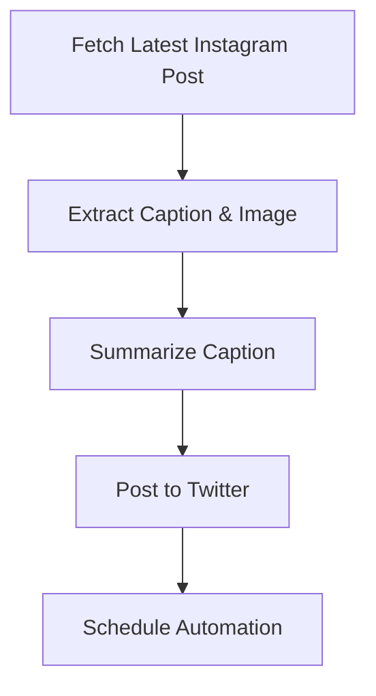

# Instagram-Twitter Automation Pipeline

🚀 Automate Instagram post retrieval, summarize captions, and post tweets!

## 📌 System Overview

This project automates the process of:

- Fetching the latest Instagram post (image & caption).
- Summarizing the caption using AI.
- Posting a tweet (with the summarized text & image).
- Providing API endpoints for seamless integration.

## 🔹 Key Features

✅ Automated Instagram post retrieval
✅ AI-powered caption summarization
✅ Seamless Twitter posting (text & image)
✅ Fully configurable & scheduled automation
✅ FastAPI-based API endpoints
✅ Logging and error handling
✅ Unit and integration tests

## 📌 System Architecture

### 🔹 Components

- **Instagram Fetcher**: Retrieves posts using the Instagrapi client.
- **Summarization Service**: Uses AI to generate a concise caption.
- **Twitter API Integration**: Posts summarized content to Twitter.
- **FastAPI Backend**: Provides API endpoints for external access.
- **Scheduler (Cron)**: Automates execution.

### 🔹 Workflow



## 📌 Setup Instructions

### 🔹 Prerequisites

✅ Python 3.10+
✅ Virtual Environment (venv)
✅ pip for package management
✅ Twitter & Instagram API credentials
✅ FastAPI & Uvicorn for the backend

### 🔹 Installation

```bash
# 1️⃣ Clone the repository
git clone https://github.com/yourusername/instagram-twitter-pipeline.git
cd instagram-twitter-pipeline

# 2️⃣ Create a virtual environment
python -m venv env
source env/bin/activate  # On Windows: env\Scripts\activate

# 3️⃣ Install dependencies
pip install -r requirements.txt

# 4️⃣ Set up environment variables
cp .env.example .env  # Update with your API keys
```

## 📌 Configuration

### 🔹 Environment Variables

Create a `.env` file with the following:

```env
TWITTER_API_KEY="your_api_key"
TWITTER_API_SECRET="your_api_secret"
TWITTER_BEARER_TOKEN="your_bearer_token"
TWITTER_ACCESS_TOKEN="your_access_token"
TWITTER_ACCESS_SECRET="your_access_secret"

INSTAGRAM_USERNAME="your_instagram_username"
INSTAGRAM_PASSWORD="your_instagram_password"

TARGET_USERNAME="target_instagram_username" (optional, default="bbcnews")
```

## 📌 Running the Application

### 🔹 Manual Execution

```bash
uvicorn app.main:app --host 0.0.0.0 --port 8000 --reload
```

### 🔹 Automate with Cron Job

```bash
crontab -e
# Run every 6 hours
0 */6 * * * /path/to/your/env/bin/python /path/to/app/main.py
```
## 📌 API Endpoints

### 🔹 GET /instagram/latest-post

Fetches the latest Instagram post.

#### Response:
```json
{
  "caption": "Latest news update...",
  "image_url": "https://example.com/image.jpg"
}
```

### 🔹 POST /post-tweet/

Fetches, summarizes, and posts the latest Instagram caption as a tweet.

#### Response:
```json
{
  "status": "Tweet posted successfully",
  "tweet_id": "1234567890",
  "text": "Breaking news summary..."
}
```

## 📌 Testing

### 🔹 Run Tests

```bash
pytest
```

### 🔹 Test Coverage

| Test Case                     | Expected Outcome          |
|--------------------------------|---------------------------|
| Fetch Instagram post           | Returns caption & image  |
| Summarize caption              | Returns a shorter summary |
| Post to Twitter (text only)    | Tweet gets posted        |
| Post to Twitter (with image)   | Tweet with image posts   |

## 📌 Deployment

### 🔹 Docker Containerization

#### 1️⃣ Build the Docker Image

```bash
docker build -t instagram-twitter-bot .
```

#### 2️⃣ Run the Container

```bash
docker run -d --env-file .env instagram-twitter-bot
```

## 📌 Contributing

### 🔹 Steps

1. Fork the repo.
2. Create a new branch:

```bash
git checkout -b feature-new-feature
```

3. Make changes & commit:

```bash
git commit -m "Added new feature"
```

4. Push & create a PR!

## 📌 License

MIT License. See `LICENSE` for details.

## 📌 Contact

💬 Have questions? Open an issue or contact me at `shivampatel887@gmail.com`

🚀 Enjoy Automating! 🎉
